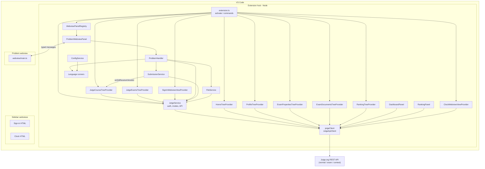

# jutge-vscode — architecture overview

This document describes how the [Jutge.org](https://jutge.org) Visual Studio Code extension is structured: main pieces, how they connect, and where to look in the source.

## Purpose in one sentence

The extension lets you sign in to Jutge.org (or an **exam** / **contest**), browse courses and problems in the sidebar, open a **problem webview** beside your code, run sample and custom tests locally, **submit** solutions, and use exam-oriented views (properties, PDF documents, timer, optional **dashboard** and **contest ranking**).

## Runtimes and UI surfaces

| Surface                        | Built from / how                                   | Role                                                                                                           |
| ------------------------------ | -------------------------------------------------- | -------------------------------------------------------------------------------------------------------------- |
| **Extension host** (Node.js)   | `src/extension.ts` → `dist/extension.js` (esbuild) | VS Code APIs, HTTP to Jutge, terminals, file I/O, tree views, webview view providers, auxiliary webview panels |
| **Problem webview** (browser)  | `src/webview/main.ts` → `dist/webview/main.js`     | Problem UI (statement, tests, actions) using `@vscode/webview-ui-toolkit`                                      |
| **Sidebar webviews** (browser) | Inline HTML in providers (e.g. sign-in, clock)     | Sign-in flows, exam timer; CSP and scripts are self-contained in those modules                                 |

The problem panel and extension host communicate through `postMessage` / `onDidReceiveMessage` with typed commands in `src/types.ts` (`VSCodeToWebviewCommand`, `WebviewToVSCodeCommand`). Sign-in and clock views use their own message protocols where needed.

Path alias **`@/`** → `src/` is configured in `esbuild.js` and TypeScript for imports such as `@/services/jutge`.

## Entry point and lifecycle

- **`package.json`** declares `main`: `./dist/extension.js`, the **Jutge.org** activity bar container, many **views** (see below), commands, settings, and **`extensionDependencies`**: **`ms-python.python`** (interpreter resolution for Python runners) and **`tomoki1207.pdf`** (PDF preview for exam documents when available).
- **`activate()`** in `src/extension.ts` stores context, sets the default API base URL, initializes **`JutgeService`** and **`ConfigService`**, creates tree views and registers **webview views** (sign-in, clock), registers the problem **webview panel serializer**, wires workspace file events to **`WebviewPanelRegistry`**, and registers commands.

**Activation events** include `onStartupFinished`, `onWebviewPanel:problemWebview`, and `onView:…` for each contributed view so the sidebar and restored problem panels load reliably—not only on first webview use.

## API modes and base URLs

**`setJutgeApiURL`** in `extension.ts` selects the REST host from **`ApiMode`**: `normal` (`api.jutge.org`), `exam` (`exam.api.jutge.org`), `contest` (`contest.api.jutge.org`), each with optional **dev** variants when using the dev API toggle during development. **`JutgeService`** switches mode on sign-in (courses vs exam vs contest) and persists tokens / mode in `globalState` (and **SecretStorage** for sign-in credentials where applicable).

## Main building blocks

### 1. Extension shell (`src/extension.ts`)

- Registers **commands**: sign in/out (courses and exam), refresh trees/views, show problem, open exam PDF, invalidate dev token, open **dashboard** and **ranking** panels.
- **`getWebviewOptions`**: CSP / `localResourceRoots` for the **problem** webview (`src/webview`, `dist`).
- **`coursesView`**: `TreeView<CourseTreeElement>` for courses—expand/collapse persistence and **`SubmissionService.onDidReceiveVeredict`** → **`JutgeCourseTreeProvider.refreshProblem`**.
- **`homeView`**: `TreeView` for the unsigned **Home** stats view.
- Helper exports unchanged in spirit: `whenWorkspaceFolder`, `getWorkspaceFolder`, `getWorkspaceFolderOrPickOne`, `getIconUri`, `getContext`, `globalStateGet` / `globalStateUpdate`.

### 2. API layer

- **`src/jutge_api_client.ts`**: generated **`JutgeApiClient`** and models for the Jutge REST API.
- **`src/services/jutge.ts`**: **`JutgeService`** — façade for auth, **`ApiMode`**, profile, problems, lists, submissions, exam/contest flows, and stale-while-revalidate-style usage of the client.
- **`jutgeClient`**: single exported **`JutgeApiClient`** instance; **`JUTGE_API_URL`** is set from **`setJutgeApiURL`**.

### 3. Sidebar — views and providers

Views are declared under the **`jutge`** container in `package.json`; visibility uses **`when`** clauses on **`jutge-vscode.isSignedIn.Courses`**, **`isSignedIn.Exam`**, and **`isContestMode`**.

| View id (concept) | Provider / implementation                                              | Notes                                                      |
| ----------------- | ---------------------------------------------------------------------- | ---------------------------------------------------------- |
| Sign in           | **`SignInWebviewViewProvider`** (`providers/sign-in-view/provider.ts`) | Webview view; course vs exam/contest sign-in               |
| Home              | **`HomeTreeProvider`** (`home-view/provider.ts`)                       | Public homepage stats when not signed in                   |
| About             | **`AboutTreeProvider`** (`about-view/provider.ts`)                     | Empty tree; copy in **`viewsWelcome`**                     |
| Courses           | **`JutgeCourseTreeProvider`** (`course-view/`)                         | Courses → lists → problems; **`jutge-vscode.showProblem`** |
| Profile           | **`ProfileTreeProvider`** (`profile-view/provider.ts`)                 | JSON-shaped user profile from API                          |
| Exams             | **`JutgeExamsTreeProvider`** (`exam-view/`)                            | Exam problems when in exam mode                            |
| Exam properties   | **`ExamPropertiesTreeProvider`** (`exam-properties-view/provider.ts`)  | Running exam metadata as tree                              |
| Documents         | **`ExamDocumentsTreeProvider`** (`exam-documents-view/provider.ts`)    | PDFs via **`jutge-vscode.openExamDocument`**               |
| Timer             | **`ClockWebviewViewProvider`** (`clock-view/provider.ts`)              | Webview view; countdown / exam time                        |
| Ranking           | **`RankingTreeProvider`** (`ranking-view/provider.ts`)                 | Contest ranking; opens **`RankingPanel`**                  |

Course and exam trees map submission status to icons via **`IconStatus`** in **`src/types.ts`**.

### 4. Auxiliary panels (not the problem webview)

- **`DashboardPanel`** (`providers/dashboard-view/provider.ts`): **`WebviewPanel`** summarizing exam progress (submissions, problems); opened from exam properties toolbar.
- **`RankingPanel`** (same `ranking-view/provider.ts`): full **ranking table** webview for contest mode.

Both poll the API on an interval and render HTML inside the extension (no shared bundle with `webview/main.ts`).

### 5. Problem UI — webview stack

Unchanged in spirit from earlier versions:

- **`WebviewPanelRegistry`** (`providers/problem-webview/panel-registry.ts`)
- **`ProblemWebviewPanel`** (`panel.ts`) + **`htmlWebview`** (`html.ts`) + **`ProblemHandler`**
- **`ProblemWebviewPanelSerializer`** (`panel-serializer.ts`)
- **`ProblemHandler`** (`services/problem-handler.ts`): files, local runners, **`SubmissionService.submitProblem`**, webview updates

### 6. Submission and tree updates

- **`SubmissionService`** (`services/submission.ts`): submit → poll verdict → **`onDidReceiveVeredict`**
- **`extension.ts`** wires verdicts to **`JutgeCourseTreeProvider.refreshProblem`** for course-mode icons

### 7. Files, config, runners

- **`FileService`** (`services/file.ts`)
- **`ConfigService`** (`services/config.ts`): **`jutge-vscode.*`** settings and Python extension API
- **`services/runners/languages.ts`**: registry (**`CppRunner`**, **`PythonRunner`**, **`GHCRunner`**) in `runners/languages/*.ts`; **`errors.ts`** for runner errors
- **`services/terminal.ts`**: terminal helpers used from the runner stack

### 8. Shared types and utilities

- **`src/types.ts`**: domain types and problem webview message contract
- **`src/utils.ts`**, **`src/loggers.ts`**

## Important exports and “global” state

| Symbol                                   | Where               | Role                                          |
| ---------------------------------------- | ------------------- | --------------------------------------------- |
| `activate`                               | `extension.ts`      | VS Code entry                                 |
| `getContext`, `setContext_`              | `extension.ts`      | Extension context                             |
| `coursesView`, `homeView`                | `extension.ts`      | Tree views                                    |
| `jutgeClient`                            | `services/jutge.ts` | Shared HTTP client                            |
| `JutgeService`                           | `services/jutge.ts` | Session, API mode, caching                    |
| `WebviewPanelRegistry`                   | `panel-registry.ts` | Problem panels                                |
| `SubmissionService.onDidReceiveVeredict` | `submission.ts`     | Verdict → course tree (+ webview via handler) |

VS Code **when-clause** keys set via `vscode.commands.executeCommand('setContext', …)` include **`jutge-vscode.isSignedIn.Courses`**, **`jutge-vscode.isSignedIn.Exam`**, **`jutge-vscode.isContestMode`**, **`jutge-vscode.isDevMode`**.

## Key classes (quick reference)

| Class                                  | File                                            | Responsibility                 |
| -------------------------------------- | ----------------------------------------------- | ------------------------------ |
| `JutgeApiClient`                       | `jutge_api_client.ts`                           | HTTP API (generated)           |
| `JutgeService`                         | `services/jutge.ts`                             | Session, modes, high-level API |
| `JutgeCourseTreeProvider`              | `providers/course-view/provider.ts`             | Courses tree                   |
| `JutgeExamsTreeProvider`               | `providers/exam-view/provider.ts`               | Exams tree                     |
| `HomeTreeProvider`                     | `providers/home-view/provider.ts`               | Home stats                     |
| `ProfileTreeProvider`                  | `providers/profile-view/provider.ts`            | Profile tree                   |
| `ExamPropertiesTreeProvider`           | `providers/exam-properties-view/provider.ts`    | Exam metadata                  |
| `ExamDocumentsTreeProvider`            | `providers/exam-documents-view/provider.ts`     | Exam PDFs                      |
| `RankingTreeProvider` / `RankingPanel` | `providers/ranking-view/provider.ts`            | Contest ranking                |
| `DashboardPanel`                       | `providers/dashboard-view/provider.ts`          | Exam dashboard panel           |
| `SignInWebviewViewProvider`            | `providers/sign-in-view/provider.ts`            | Sign-in webview                |
| `ClockWebviewViewProvider`             | `providers/clock-view/provider.ts`              | Timer webview                  |
| `ProblemWebviewPanel`                  | `providers/problem-webview/panel.ts`            | Problem panel + messaging      |
| `WebviewPanelRegistry`                 | `providers/problem-webview/panel-registry.ts`   | Panel lifecycle                |
| `ProblemWebviewPanelSerializer`        | `providers/problem-webview/panel-serializer.ts` | Restore state                  |
| `ProblemHandler`                       | `services/problem-handler.ts`                   | Tests, submit, files           |
| `SubmissionService`                    | `services/submission.ts`                        | Submit + poll + events         |
| `FileService`                          | `services/file.ts`                              | Files / testcases              |
| `ConfigService`                        | `services/config.ts`                            | Settings + Python env          |

## Repository layout (mental map)

```
src/
  extension.ts              # activate, commands, views, wiring
  jutge_api_client.ts       # generated API client
  types.ts                  # shared types / problem webview messages
  utils.ts, loggers.ts
  providers/
    about-view/
    clock-view/
    course-view/
    dashboard-view/
    exam-documents-view/
    exam-properties-view/
    exam-view/
    home-view/
    problem-webview/        # panel, HTML, registry, serializer
    profile-view/
    ranking-view/
    sign-in-view/
  services/
    jutge.ts
    submission.ts
    problem-handler.ts
    file.ts
    config.ts
    terminal.ts
    runners/
      languages.ts
      languages/cpp.ts, python.ts, ghc.ts
      errors.ts
  webview/                  # problem UI bundle: main.ts, components, styles
dist/                       # esbuild output (extension.js + webview/main.js)
resources/                  # icons (light/dark), branding
```

## Diagram — how the pieces relate



## Practical reading order

1. `src/extension.ts` — registration and commands.
2. `src/services/jutge.ts` — auth, **`ApiMode`**, and data access.
3. `src/providers/problem-webview/panel.ts` + `src/services/problem-handler.ts` — problem workflow end-to-end.
4. `src/types.ts` + `src/webview/main.ts` — host ↔ problem webview contract.
5. For exam/contest UX: `sign-in-view/provider.ts`, `exam-properties-view`, `dashboard-view`, `ranking-view`.

---

_Generated for repository navigation; behavior details live in source and `package.json`._
