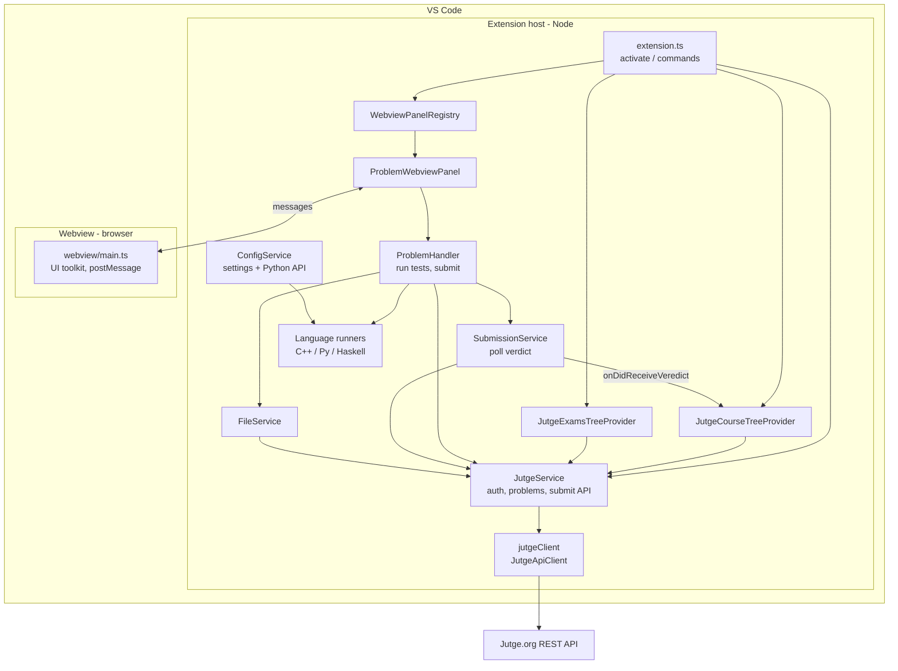

# jutge-vscode — architecture overview

This document describes how the [Jutge.org](https://jutge.org) Visual Studio Code extension is structured: main pieces, how they connect, and where to look in the source.

## Purpose in one sentence

The extension lets you sign in to Jutge.org (or an exam), browse courses and problems in the sidebar, open a **problem webview** beside your code, run sample and custom tests locally, and **submit** solutions to the platform.

## Two runtimes

| Runtime                       | Built from                                         | Role                                                                      |
| ----------------------------- | -------------------------------------------------- | ------------------------------------------------------------------------- |
| **Extension host** (Node.js)  | `src/extension.ts` → `dist/extension.js` (esbuild) | VS Code APIs, HTTP to Jutge, terminals, file I/O, tree views              |
| **Webview** (browser context) | `src/webview/main.ts` → `dist/webview/main.js`     | Problem UI (statement, tests, buttons) using `@vscode/webview-ui-toolkit` |

They talk through `postMessage` / `onDidReceiveMessage` with typed commands in `src/types.ts` (`VSCodeToWebviewCommand`, `WebviewToVSCodeCommand`).

## Entry point and lifecycle

- **`package.json`** declares `main`: `./dist/extension.js`, UI contributions (activity bar **Jutge.org**, tree views **Courses** / **Exams**, commands, settings), and depends on **`ms-python.python`** for interpreter resolution when running Python.
- **`activate()`** in `src/extension.ts` is the real bootstrap: stores the `ExtensionContext`, sets the API base URL, initializes `JutgeService` and `ConfigService`, creates tree views, registers the webview panel serializer, wires workspace file events to `WebviewPanelRegistry`, and registers all commands.

Activation is declared for `onWebviewPanel:problemWebview` so the extension can restore problem panels after reload; trees and commands still become available when the user interacts with the Jutge sidebar or runs a command.

## Main building blocks

### 1. Extension shell (`src/extension.ts`)

- Registers **commands** (sign in/out, exam sign in/out, refresh trees, show problem, dev token invalidate).
- **`setJutgeApiURL`**: switches between normal and **exam** API host (`api.jutge.org` vs `exam.api.jutge.org`).
- **`getContext()` / `globalStateGet` / `globalStateUpdate`**: module-level access to `vscode.ExtensionContext` and persisted keys (tokens, tree expand/collapse).
- **`getWebviewOptions`**: CSP / `localResourceRoots` for the problem webview.
- **`coursesView`**: the `TreeView` instance for courses (used to persist expand/collapse and to subscribe to submission verdicts). The element type is **`CourseTreeElement`** in `src/providers/course-view/element.ts` (the type imported in `extension.ts` should match that module).

Helper exports: `whenWorkspaceFolder`, `getWorkspaceFolder`, `getWorkspaceFolderOrPickOne`, `getIconUri`.

### 2. API layer

- **`src/jutge_api_client.ts`**: large **generated** client (`JutgeApiClient`) with request types and models for the Jutge REST API.
- **`src/services/jutge.ts`**: **`JutgeService`** — the façade used everywhere: auth (tokens in `globalState`), exam vs course mode, profile, problems, lists, submissions, and **stale-while-revalidate**-style wrappers over the client.
- **`jutgeClient`**: a single exported **`JutgeApiClient`** instance; `JUTGE_API_URL` is assigned from `extension.setJutgeApiURL`.

### 3. Sidebar — tree data providers

- **`JutgeCourseTreeProvider`** (`src/providers/course-view/provider.ts`): courses → lists → problems; uses **`CourseTreeElement`** / **`CourseTreeItem`** (`course-view/element.ts`, `item.ts`). Problems run `jutge-vscode.showProblem`.
- **`JutgeExamsTreeProvider`** (`src/providers/exam-view/provider.ts`): flat list of exam problems when signed in with exam credentials; **`ExamTreeElement`**, reuses **`CourseTreeItem`** for rendering.

Both providers call **`JutgeService`** for data and map submission status to icons via **`IconStatus`** (`src/types.ts`).

### 4. Problem UI — webview stack

- **`WebviewPanelRegistry`** (`src/providers/problem-webview/panel-registry.ts`): one **`ProblemWebviewPanel`** per problem id; create, reveal, dispose, and notify when workspace files change.
- **`ProblemWebviewPanel`** (`panel.ts`): owns `vscode.WebviewPanel`, loads problem data, builds HTML via **`htmlWebview`** (`html.ts`), dispatches webview messages to **`ProblemHandler`**.
- **`ProblemWebviewPanelSerializer`** (`panel-serializer.ts`): restores panels after VS Code restart.
- **`ProblemHandler`** (`src/services/problem-handler.ts`): create/open source files, run testcases locally (language runners), drive **`SubmissionService.submitProblem`**, push status updates back to the webview.

### 5. Submission and tree updates

- **`SubmissionService`** (`src/services/submission.ts`): submit file → poll verdict → emits **`onDidReceiveVeredict`** (`Veredict`: problem id + status).
- **`extension.ts`** subscribes and calls **`JutgeCourseTreeProvider.refreshProblem`** so the course tree icons reflect the latest verdict.

### 6. Files, config, runners

- **`FileService`** (`src/services/file.ts`): headers for new files, custom testcase files, reading/writing helpers tied to workspace layout.
- **`ConfigService`** (`src/services/config.ts`): reads `jutge-vscode.*` settings and the **Python extension API** for the active interpreter; compiler flags for C++/Haskell/Python runners.
- **`src/services/runners/languages*.ts`**: **`CppRunner`**, **`PythonRunner`**, **`GHCRunner`** — local compile/run for tests (not the Jutge sandbox).

### 7. Shared types and utilities

- **`src/types.ts`**: domain types (`Problem`, messages, enums), kept in sync with webview usage.
- **`src/utils.ts`**: filenames, problem ids from paths, editor helpers, etc.
- **`src/loggers.ts`**: **`Logger`** / **`StaticLogger`** — thin `console` wrappers with class names.

## Important exports and “global” state

| Symbol                                            | Where               | Role                                  |
| ------------------------------------------------- | ------------------- | ------------------------------------- |
| `activate`                                        | `extension.ts`      | VS Code entry                         |
| `context_` (private), `getContext`, `setContext_` | `extension.ts`      | Global extension context              |
| `coursesView`                                     | `extension.ts`      | `TreeView<CourseTreeElement> \| null` |
| `jutgeClient`                                     | `services/jutge.ts` | Shared `JutgeApiClient`               |
| `JutgeService` (static)                           | `services/jutge.ts` | Auth, API orchestration, exam mode    |
| `WebviewPanelRegistry` (static map)               | `panel-registry.ts` | Open problem panels                   |
| `SubmissionService.onDidReceiveVeredict`          | `submission.ts`     | Verdict → UI (tree + webview)         |

VS Code **when-clause context** keys (not TypeScript globals) are set via `vscode.commands.executeCommand('setContext', ...)`, for example `jutge-vscode.isSignedIn.Courses`, `jutge-vscode.isSignedIn.Exam`, `jutge-vscode.isDevMode`.

## Key classes (quick reference)

| Class                           | File                                            | Responsibility                   |
| ------------------------------- | ----------------------------------------------- | -------------------------------- |
| `JutgeApiClient`                | `jutge_api_client.ts`                           | HTTP API (generated)             |
| `JutgeService`                  | `services/jutge.ts`                             | Session, caching, high-level API |
| `JutgeCourseTreeProvider`       | `providers/course-view/provider.ts`             | Courses tree                     |
| `JutgeExamsTreeProvider`        | `providers/exam-view/provider.ts`               | Exams tree                       |
| `ProblemWebviewPanel`           | `providers/problem-webview/panel.ts`            | One problem panel + messaging    |
| `WebviewPanelRegistry`          | `providers/problem-webview/panel-registry.ts`   | Panel lifecycle map              |
| `ProblemWebviewPanelSerializer` | `providers/problem-webview/panel-serializer.ts` | Restore state                    |
| `ProblemHandler`                | `services/problem-handler.ts`                   | Run tests, submit, file flows    |
| `SubmissionService`             | `services/submission.ts`                        | Submit + poll + events           |
| `FileService`                   | `services/file.ts`                              | File creation / testcases        |
| `ConfigService`                 | `services/config.ts`                            | Settings + Python env            |

## Repository layout (mental map)

```
src/
  extension.ts              # activate, commands, trees, wiring
  jutge_api_client.ts       # generated API client
  types.ts                  # shared enums/types/messages
  utils.ts, loggers.ts
  providers/
    course-view/            # courses tree
    exam-view/              # exams tree
    problem-webview/        # panel, HTML, registry, serializer
  services/
    jutge.ts                # JutgeService + jutgeClient
    submission.ts
    problem-handler.ts
    file.ts
    config.ts
    terminal.ts             # (if used from runners)
    runners/                # local language execution
  webview/                  # separate bundle: main.ts, styles, small components
dist/                       # esbuild output (extension + webview)
resources/                  # icons for views and commands
```

## Diagram — how the pieces relate



## Practical reading order

1. `src/extension.ts` — see what registers on startup.
2. `src/services/jutge.ts` — auth and data fetching.
3. `src/providers/problem-webview/panel.ts` + `src/services/problem-handler.ts` — problem workflow end-to-end.
4. `src/types.ts` + `src/webview/main.ts` — contract between host and webview.

---

_Generated for repository navigation; behavior details live in source and `package.json`._
